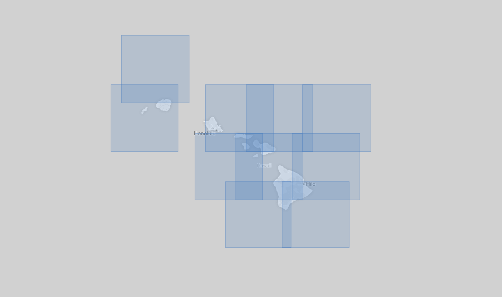

Interface to REST services for planetary imagery with the goal of affording the transfer of mission data into an openly available and homogeneous data store.

Documentation is available at: https://usgs-astrogeology.github.io/bayleef/

## Congfiguration 

After installing dependencies note their paths, then edit `bayleef/examples/config/config.yaml` and input the full paths to 
- `data` - temporary path bayleef will use for data storage & processing.
    - CAVEAT: The `config.yaml` file will be copied to the `data` path, and will be defaulted to instead of the one in the repository. Future changes to the config should be done to that file.
- `davinci_bin` - path to [davinci](http://davinci.asu.edu/) installation
- `themis: controlled_kernels` - path to themis kernels.
- `themis: map_file` - full path to the `bayleef/examples/isis_files/equirectangular.map` file in this repository.

## CLI Overview

The CLI allows for the programatic searching, downloading and uploading (to a Postgres server) of USGS data.

The workflow is :

login -> search -> download -> upload  

#### Login

Before you can do anything, you must login using the CLI, logging in requires that you have a USGS EROS account https://ers.cr.usgs.gov/login/ and have authorization to download orders from the RESTful api.   

```
bayleef login [user] [pass]
```

#### Search

```
usgs search [dataset] --node [node] --start-date [start date] --end-date [end date] --longitude [lng] --latitude [lat] --dist [radius]
```

Returns a JSON string with containing result metadata. The JSON blob doesn't mean much in terms of human readability, but with the optional `--geojson`, the response is turned into GeoJSON which can be rendered to visualize footprints in a viewer (e.g. QGIS, Github Gist).  

Breakdown:

 - **[node]** : Name of the catalog to search in (e.g. cwic for CWIC/LSI Explorer, ee for Earth Explorer, ect.), [see docs](https://kelvinrr.github.io/bayleef/reference/catalog.html) for a list of available nodes
 - **[dataset]** : The specific collection to download from (e.g. LANDSAT_8_C1 for landsat 8 collection 1), [see docs](https://kelvinrr.github.io/bayleef/reference/catalog.html)  for a list of available datasets
 - **[start-data]/[end-data]** : Dates when dataset are aquired in yyyy-mm-dd format
 - **[longitude]/[latitude]** : lon/lat point the image footprint should intersect
 - **[radius]** : radius in meters from the lat lon point, if --dist is passed in, any image with a footprint overlapping the circle will be accepted.

#### Download

The search JSON response comes with a download URL. It would be trivial to download a individual image from the download string, but for users more interested in the shotgun approach of simply grabbing all the images that match a search criteria and dump them into a download directory, there is `bayleef batch-download`.

`bayleef batch-download` accepts the JSON string returned from `bayleef search` and mass downloads all the images listed and transforms them into a common format (GeoTIFFs). For example, you can run a spatiotemporal search over Hawaii, and pipe the resulting JSON blob into batch-download.

```
bayleef search [args] | bayleef batch-download [root] [node]
```

Breakdown:

 - **[args]** : the same args you use in `search`, as the results define what is downloaded
 - **[root]** : Download location. For each dataset, bayleef has a predefined path structure. For example, Landsat 8 is `[year]/[row]/[path]/id.iff`. So you want to reuse the same root directory for every download operation.
 - **[node]** : Name of the catalog to search in (e.g. cwic for CWIC/LSI Explorer, ee for Earth Explorer, ect.), [see docs](https://kelvinrr.github.io/bayleef/reference/catalog.html)  for a list of available nodes

> ** NOTE ** Each dataset requires a custom ingestion function for batch-downloading, so check the docs for a list of datasets available for download.

#### Upload  

Once the files are downloaded into a homogenous structured format using `batch-download`, they need to be uploaded into a PostGIS database for querying and processing. All tables are stored into schemas matching the dataset name.

```
bayleef to-sql --host [HOST] --port [PORT] --user [USER] --password [PASS] [DATASET] [ROOT] [DB]
```

Breakdown:

- **[HOST]/[PORT]/[USER]/[PASSWORD]** : Conenction and login info for the PostgreSQL instance
- **[dataset]** : The specific collection to download from (e.g. LANDSAT_8_C1 for landsat 8 collection 1), [see docs](https://kelvinrr.github.io/bayleef/reference/catalog.html)  for a list of available datasets
- **[ROOT]** : Should be the same as the root passed into `batch-download`, the location of the downloaded files.
- **[DB]** Name of the database to upload to.

## Example

```
# Get night time Landsat 8 images given a bounding box and time range
bayleef search LANDSAT_8_C1 --lower-left -165 15 --upper-right -150.0 28.0 --start-date 2013-04-01 --end-date 2013-05-1 where 20513 Night --geojson
```

[](https://render.githubusercontent.com/view/geojson?commit=796cfecce7dbfaaf34664506c3f98d063f57c587&enc_url=68747470733a2f2f7261772e67697468756275736572636f6e74656e742e636f6d2f676973742f4b656c76696e72722f34303439363865643535613864616261613131356533313333623730343832652f7261772f373936636665636365376462666161663334363634353036633366393864303633663537633538372f746573742e67656f6a736f6e&nwo=Kelvinrr%2F404968ed55a8dabaa115e3133b70482e&path=test.geojson&repository_id=89327932&repository_type=Gist#7396ae8f-0d23-4319-bc9c-64a4e15e14d7)
